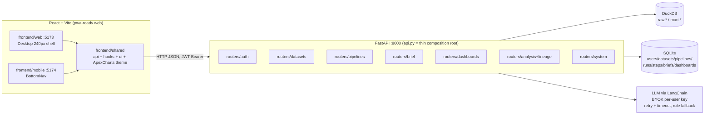
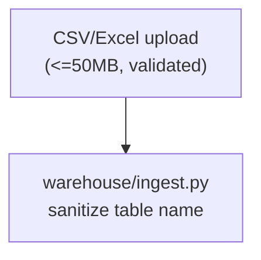
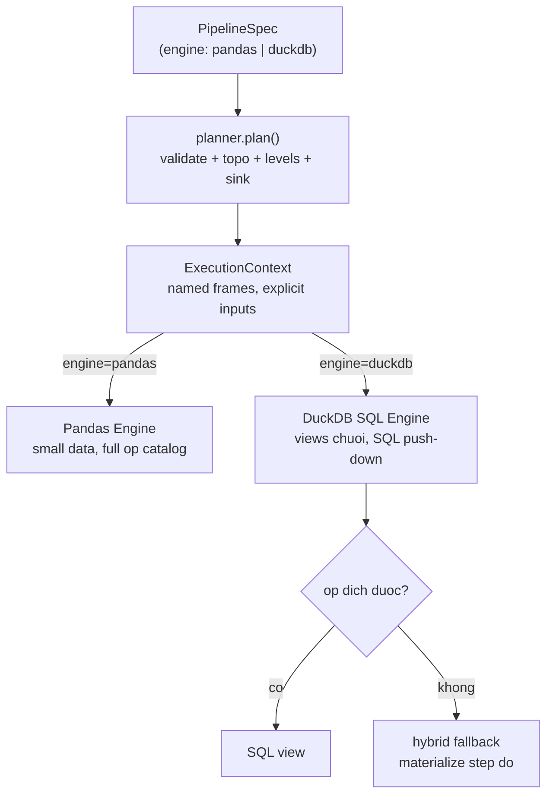
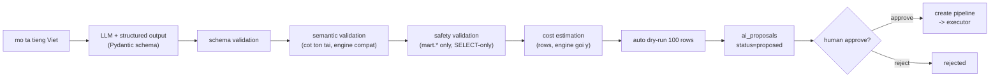
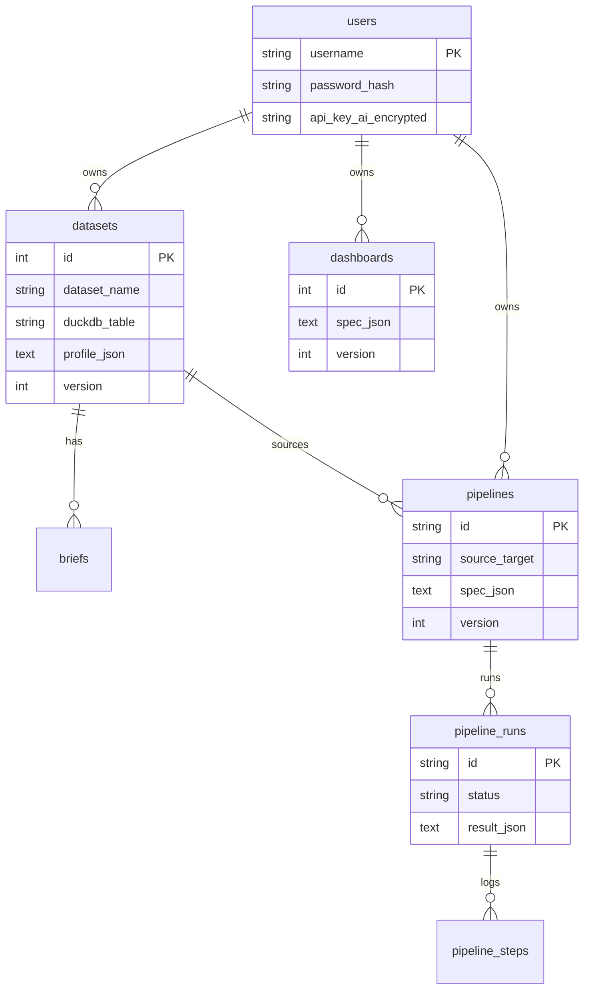
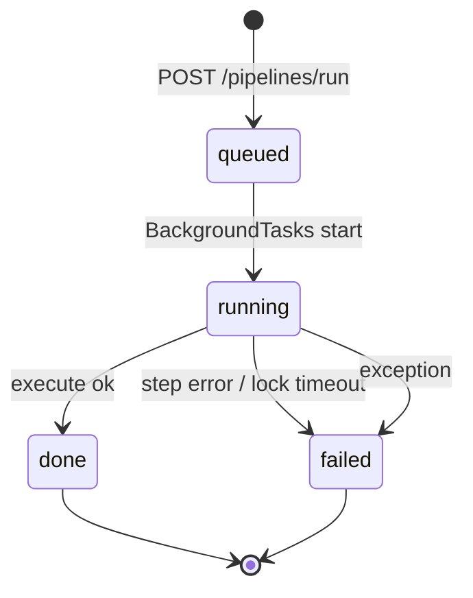
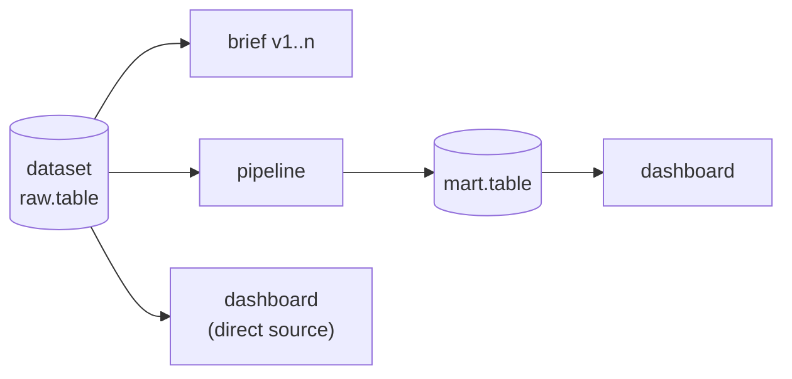

# Architecture — AI Data Engineering Workbench

Repo/project: `dataworkbench`. Local-first workbench:
`Ingest → Pipeline (ETL/ELT) → Brief → Dashboard`, plus Statistics Lab and visual lineage.
Detail history: `docs/plan/02-architecture.md`, `docs/plan/implement_plan.md`.

## 1. System overview



## 2. Data flow



### 2b. Execution engines (scalability)



- Pandas: `fetchdf()` toàn bộ source — ok tới ~100K rows.
- DuckDB: không fetch toàn bộ (chỉ preview LIMIT 5 + COUNT); mỗi op có bản dịch SQL
  (`fill_missing`→COALESCE, `drop_duplicates`→DISTINCT, `aggregate`→GROUP BY...);
  op không dịch được (`derive`/`filter` lạ) fallback hybrid từng step, liệt kê trong `fallbacks`.
- Kết quả trả `engine_used` + `sink` + `levels`.
  ING --> RAW[("raw.table\nDuckDB")]
  RAW --> PROF["profile JSON\n(never raw rows to LLM)"]
  PROF --> SPEC["PipelineSpec\n(DAG validate, 7 pandas ops + sql)"]
  SPEC -->|dry-run 100 rows| PREV["preview"]
  SPEC -->|BackgroundTasks| MART[("mart.table\natomic CREATE OR REPLACE\nwarehouse_write_lock")]
  MART --> BRIEF["brief (versioned)"]
  MART --> DBOARD["dashboard spec\n1 query/chart → ApexCharts JSON"]
  RAW --> PIPE["pipelines"]
  PIPE --> MART
  MART --> DBOARD
```

LLM only ever receives **profile JSON + brief text** (never raw rows).

### 2c. AI production-grade — LLM proposes. Engine validates. Human approves. Executor executes.



- Loi provider co kieu (`llm_errors.py`): retry `RateLimit/Timeout/Server`, fallback ngay `Auth/InvalidRequest` — khong string-matching.
- Output validate 2 lop: Pydantic schema (`prompts/schemas.py`) + business validation (column ton tai, type ho tro).
- AI khong bao gio execute truc tiep: `POST /pipelines` voi `proposal_id` doi hoi status `approved` (403 neu chua).
- Rate limit: Redis share giua workers (`redis` service trong compose); in-memory chi fallback dev single-worker.

### 2d. Data Contract + reproducibility + observability

- **Contract gate** (`pipeline/contract.py`): spec mang `contract` (min_rows, missing/dup %, kieu/mien gia tri tung cot).
  Gate chay tren bounded sample (10k rows, ke ca engine duckdb) truoc execute — rot la failed kem report.
- **Reproducibility**: `spec_hash` (sha256 canonical) tren proposal + run; pipeline luu `proposal_id`;
  `GET /pipelines/{id}/reproduce` tra snapshot tao + hash + engine; `GET /runs/{id}` tra hash/engine/duration.
- **Observability**: run ghi `started_at/finished_at/rows_out/engine`; `GET /pipelines/{id}/stats`
  (success rate, avg/last duration, engine breakdown, step status); executor tra `step_timings` moi step.

## 3. Backend layout

```
api.py                      # thin root: app, CORS, error handlers, include_router x7
src/api/deps.py             # JWT, Redis/in-memory rate limit, _user_owns_table
src/api/routers/            # auth/datasets/pipelines/brief/dashboards/analysis/system
src/core/database.py        # SQLAlchemy models + session_scope() (commit/rollback)
src/warehouse/              # DuckDB connection (+write lock), ingest, registry, lineage graph
src/pipeline/               # spec_schema (DAG validate), executor, ops (pandas + hardened sql)
src/dashboard/              # spec_schema + renderer (fetch_data 1 query/chart)
src/prompts/                # briefer/etl_author/dashboard_author (profile-only, fallbacks)
src/core/ai_service.py      # LangChain LLM, timeout/retry/backoff, keyed cache, rule fallback
src/utils/                  # security (JWT/CORS), exceptions ({code,message,detail,trace_id}),
                            # validators, logging_config (rotating files)
```

## 4. Metadata schema (SQLite)



Versioning: `briefs` version per dataset; `pipelines`/`dashboards` bump `version` on PUT;
`datasets` are immutable per name (`version=1`, foundation for re-ingest versioning).

## 5. Pipeline run lifecycle + concurrency



- One `threading.Lock` per `pipeline_id`: a second run of the **same** pipeline → `409`.
- DuckDB writes serialized by `warehouse_write_lock` (thread RLock + file lock, 30s timeout).
- `api.py` runs single uvicorn worker; multi-worker needs Redis + external queue (documented in Dockerfile).
- Every run writes `pipeline_steps` rows (`done/failed/skipped` + log excerpt); `GET /runs/{id}` returns them.

## 6. Security model

- JWT Bearer (`HS256`, auto dev key in `.jwt_secret` 0600, **required** in production).
- Ownership enforced per row: datasets/pipelines/runs/briefs/dashboards/lineage (`403/404`).
- Table identifiers validated `^(raw|mart)\.[A-Za-z_][A-Za-z0-9_]{0,63}$` + quoted; `sql` op allows only single `SELECT/WITH`, blocks DDL/DML keywords.
- Uploads: extension allowlist, 0-byte reject, 50MB cap, empty-frame reject.
- BYOK keys Fernet-encrypted at rest; per-(provider,key) service cache (no cross-user leak).

## 7. Lineage graph

`GET /lineage/{dataset_id}` returns `{nodes, edges}`:



UI (`Lineage.tsx` web+mobile) renders kind-grouped columns with hover edge tooltips.

## 8. Deploy

- Dev: `uvicorn api:app --port 8000` + `pnpm dev:web (:5173)` / `dev:mobile (:5174)`.
- Prod: `docker compose --profile production up --build -d` → `backend :8000` (non-root `appuser`, healthcheck) + `frontend :80` (nginx: web `/`, mobile `/app/mobile/`, `/api/` proxy + rate limits).
- CI (`.github/workflows/ci.yml`): flake8/black/isort + full pytest + frontend typecheck (enforced) + compose validate + backend/frontend image builds with GHA cache.

## 9. Test map

| Suite | Covers |
|---|---|
| `test_e2e.py` | register → ingest → pipeline → dashboard → lineage |
| `test_e2e_stability.py` | error shape, api-key, upload, spec validation, 403s, SQLi, steps, 409, dashboard ownership, versioning, lineage graph |
| `test_api.py` | auth/analysis endpoints (mocked DB fns) |
| `test_llm_retry.py` | LLM retry/success, non-retryable, fallback, keyed cache |
| `test_pipeline/warehouse/security/...` | engine, validators, DB, stats |
